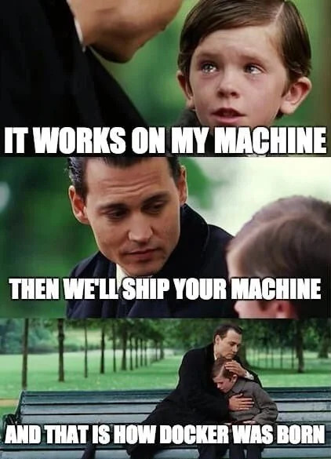

# Docker

Nowadays docker is a mandatory skill for any kind of programming job.
Docker is a toolchain to build containerized applications and also run them
in a dedicated environment.

## Disclaimer

A lot of things will be a bit vague in the following sections.
Fact is, running containers does not work everywhere the same.
The runtime varies depending on the operating system and configuration.
Thus it is hard to establish a general truth in a lot of statements.
Main focus will be here docker on Linux.

## Containerization

The rough idea of docker is as follows:



Often an application requires additional things.
For example python applications require a system with python including all
required dependencies installed.
But beyond that, some python libraries are written in C/C++ or Fortran and
require additional runtime libraries such as the Intel Math Kernel Library
(MKL).
And even if your target system has those libraries, it might not have them in
the right version and things get funny.
You get the idea why shipping an application with an entire environment makes
a lot of sense for anything more complex.
Beyond environments, it is also important to isolate applications.
If you run 20 applications on a server next to each other they might at best
interfere with each other and at worst hack each other due to CVEs.
Also their dependencies will very likely conflict at these numbers.
Thus isolation is also a really important reason for containers.
Note there are other solutions than containerization (see [WASM] for example).

[WASM]: https://webassembly.org/

## How it works

Docker does roughly two things:

- Building a docker image
- Running the docker image as a container

There is more and of course in detail things are more complicated but that is a
topic for another time.
A docker image can be imagined like an operating system like image e.g. Ubuntu
on which you install your dependencies and application.
This is done in a `Dockerfile` which is basically just an installation procedure
written down with some additional features.
After building the image (more about that later), it can be run or stored
externally for e.g. servers to pull them and run them themselves.

> Docker in its essence runs a dedicated application as a process in an
> isolated filesystem, the docker image, with limited restrictions such as
> memory, networking or CPU.

The image still runs on the original system as a dedicated process, so it is not
a dedicated operating system running but just the environment.
This is the major difference to VMs by the way and means you cannot run a
windows image on linux and vice versa although there are container runtimes scheduling containers in a VM which makes it possible.

## Containerize all the things

Here, we want to containerize our API server.
This is pretty much standard procedure so in case you search for a job to build
APIs you can expect having to containerize them.
To get started, [install docker][install-docker].
Next we need a `Dockerfile`.
Check out the following content and go through it:

```dockerfile
```

Now how to we build the container?
Simply by running:

```console
$ docker build -f Dockerfile .
```

Where `-f` denotes the file (optional) and `.` denotes the "context" aka
directory.
Store this command in your `Taskfile.yaml` to not forget it:

```yaml
  docker:build:
    desc: Build the docker image
    cmds:
      - docker build -f Dockerfile .
```

[install-docker]: https://docs.docker.com/engine/
